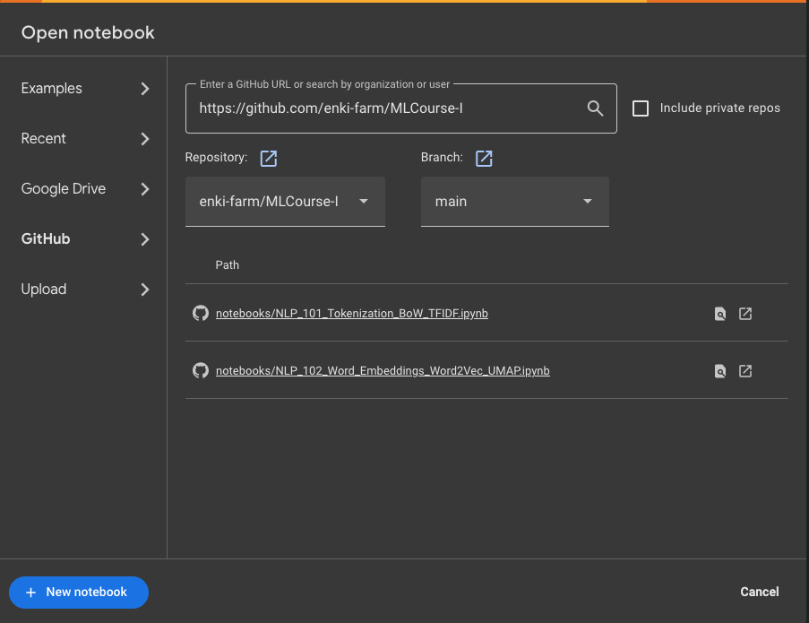

# 🌟 Welcome to MLCourse-I! 🚀

Welcome, fellow explorer! 🌌 Whether you're a seasoned programmer or just starting your journey into the fascinating world of Machine Learning, this repository is here to guide you like a trusty companion through the galaxy of ML concepts. Think of it as your **Hitchhiker's Guide to Machine Learning**—don't forget your towel! 🧳

## 🧠 What's This All About?

The purpose of this course is to make Machine Learning approachable, practical, and fun! We'll dive into key concepts, work through hands-on examples, and build a solid foundation for solving real-world problems with ML. From **Natural Language Processing (NLP)** to **data visualization**, this course has something for everyone.

## 🛠️ How to Get Started

### Run Locally in JupyterLab 🖥️

Want to run everything on your own machine? No problem! Just follow these steps:

```bash
docker build -t mlcourse-lab .
docker run -it --rm -v $(PWD):/workspace -p 8888:8888 mlcourse-lab
```

Once the container is running, open your browser and navigate to `http://localhost:8888`. Voilà! You're ready to start exploring.

### Run in Google Colab 🌐

Prefer to work in the cloud? We've got you covered! Google Colab is a fantastic way to run notebooks without worrying about local setup.

1. Go to [Google Colab](https://colab.research.google.com/).
2. Click on `Open notebook`, go to the `GitHub` tab, and enter this repository URL:  
   👉 `https://github.com/enki-farm/MLCourse-I`
3. Choose the notebook you want to use, and you're ready to roll!



## 🌟 Why Should You Care?

Machine Learning is transforming industries, from healthcare to entertainment. This course is designed to help you:
- **Understand ML concepts** without feeling overwhelmed.
- **Build practical skills** through hands-on exercises.
- **Have fun** while learning something new! 🎉

Whether you're here to level up your skills or just satisfy your curiosity, this course is for you. So buckle up, and let's embark on this exciting journey together! 🚀

---

## 📚 Topics Covered

Here’s a sneak peek at what you’ll learn:
- **Natural Language Processing (NLP)**: Tokenization, Bag of Words, TF-IDF, and more.
- **Data Preprocessing**: Cleaning and preparing data for ML models.
- **Visualization**: Making sense of data through graphs and charts.
- And much more!

---

## 🤝 Contributing

Found a bug? Have an idea to make this course even better? Contributions are always welcome! Feel free to open an issue or submit a pull request.

---

## 🌈 Final Thoughts

Learning Machine Learning can feel like navigating uncharted territory, but with this course, you'll have a map, a guide, and a community to support you. So grab your favorite beverage ☕, fire up your terminal, and let's make some magic happen! ✨